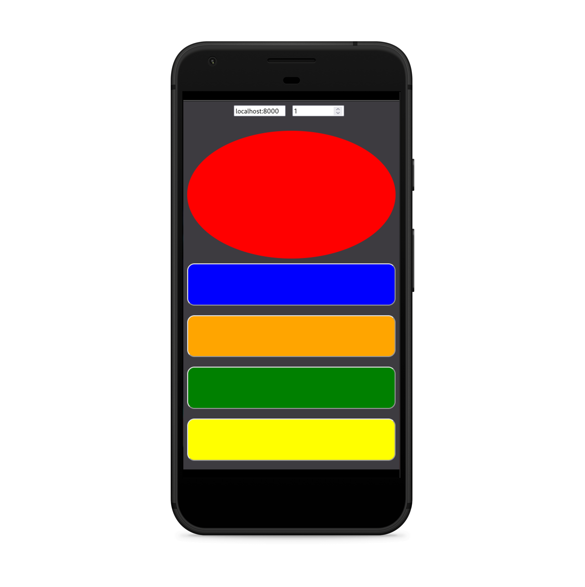

Application based on the project Colorful button

Steam deck installation

git clone https://github.com/teixeiras/buzz
mkdir ~/projects
mv buzz ~/projects
cp systemd ~/.config/systemd/user/buttons.service
systemctl --user enable buttons
systemctl --user start buttons

# 🎮 Colorful Buttons 🌟

A simple Python script simulates the "Buzz!" Playstation 2 controller using a Smartphone or Tablet.

## How to use:

1. Ensure that you have Python and pip installed on your system.
2. Install the [vgamepad](https://pypi.org/project/vgamepad/) library using the command: `pip install vgamepad`. If you're on Linux, refer to [this guide](https://github.com/yannbouteiller/vgamepad/blob/main/readme/linux.md).
3. Start the server by setting the `--playercount` and `--address` arguments like this: `python server.py --playercount {Number of players} --address {your IP address}`. To find your IP address, you can use commands like `ipconfig` (Windows) or `ifconfig` (Linux/macOS) in the terminal.
4. You can now go to the website and configure the controller on your smartphone (The script will tell you all necessary information).
5. Configure the controller within your preferred emulator as you usually would. The controller will appear as an Xbox gamepad in your device list.

## Troubleshooting:
1. **I can't open the website that hosts the controller:**
    1. Ensure that ports 8000 and 8001 are open on your network system.
    2. Try using different ports (`--webport` and `--socketport`).
    3. Directly send the `index.html` file to the device you want to use as a controller.
2. **My controller input is not recognized:**
    1. If you're using Linux, refer to [this guide](https://github.com/yannbouteiller/vgamepad/blob/main/readme/linux.md).
    2. Test the controller using [hardwaretester.com/gamepad](https://hardwaretester.com/gamepad).
    3. Ensure you've inputted the correct server and port (the script will provide this information).

If you encounter any problems, feel free to [contact me](https://aaron.place/placeholder/) or open an issue. 🛠️🎮✨

